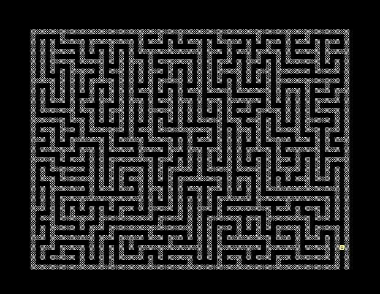

# Introduction

本项目是一个 agent 走迷宫的问题（迷宫如下图所示），给定任意起点和终点，目的是求解从起点到终点的最短路径.



#### 假设

- agent 可以记忆经过的所有节点位置($V$)和从一个节点到另一个相邻节点需选择的岔路和行进的步数($D$)，记为 $G(V, D)$，并可以通过 Dijkstra 算法规划出从当前位置到 $V$ 中任意节点之间的最短路径；（_节点定义：有大于或等于三个可前进方向的路口、死路尽头、起点_）；
- 当 agent 第一次进入迷宫时，不清楚迷宫的布局($V=\{\text{起点}\}$)；
- agent 仅可以从迷宫获取在当前位置可前进的方向，不能获取当前位置是否离终点更近的信息；
- agent 从起点出发时，迷宫将告知能直接（_不经过任何节点_）到达终点的节点位置和需选择的岔路（_这相当于把终点挪到了离终点最近的节点，并告知节点位置，若不想这样做，也可以设定更稠密的图来表示这个迷宫_）.

为此，我们设计了一个强化学习模型，模型的具体细节如下：

#### 模型

- **State:** agent 走到节点时所处的位置和当前的 $G(V, D)$
- **Actions:** 现有的未探索的岔路（_针对路口节点_）或未知路口（_针对死路尽头节点，即 agent 曾经经过，但没有走完其所有岔路的路口_）
- **Feedback:** 在当前位置可前进的方向、当前位置是否是终点
- **Memory:** $G(V, D)$，即 agent 经过的所有节点($V$)、从一个节点到另一个相邻节点需选择的岔路和行进的步数($D$)
- **Q function:** $Q(s,a)=$ 从当前位置 $s$ 选择动作 $a$ ，到达终点花费的最少成本（若 $s$ 是死路尽头，则 $Q$ 就是在当前位置 $s$ 从已走过的路返回未知路口 $a$ 的最短距离的负数；若 $s$ 是路口，则未选过的岔路的 $Q$ 很大，而选过的岔路的 $Q$ 很小，即 agent 倾向于选择未走过的岔路）
- **Policy:** $\arg\max_a \text{softmax}(Q(s,a))$

# Configuration instructions

代码文件采用 python 3.8.15 语言, 运行前请确认已安装如下的库：

```python
numpy
cv2 # 用于交互可视化
random
```

# Operating instructions

#### 交互可视化

运行**main.py**文件，点击地图中的任意位置来设置终点，当 agent 求解出到达终点的最短路径后，按空格键重新设置终点，按 Esc 键关闭窗口.

#### 导入地图并定义绘制图像所需的各图层

```python
img = cv2.imread("./image/fig.jpg", 1)
maze = img.copy()
maze[400:408,554:562] = 0
maze = maze[48:440, 50:570, :]
agent = img[400:408,554:562].copy()
steplen = 8
boundary = (440-48,570-50)
maze_size = (49, 65)
destination = np.kron(np.ones((steplen,steplen,1), dtype=np.uint8),np.array([0,255,255], dtype=np.uint8))
trail0 = np.zeros((steplen,steplen,1), dtype=np.uint8)
trail0[3:5,3:5,:] = 1
trail0 = np.kron(trail0,np.array([0,255,0], dtype=np.uint8))
trail1 = np.ones((steplen,steplen,1), dtype=np.uint8)
trail1 = np.kron(trail1,np.array([0,255,0], dtype=np.uint8))
```

#### 设置环境

```python
# calculate the wall position
wall = np.zeros(maze_size, dtype=np.uint8)
for i in range(maze_size[0]):
    for j in range(maze_size[1]):
        itmp = i*steplen
        jtmp = j*steplen
        if np.mean(maze[itmp:itmp+steplen, jtmp:jtmp+steplen, :]) > 80:
            wall[i,j] = 1

env = Maze(wall)
```

#### 设置 Agent（参数说明见 Agent.py）

```python
start_pos = (44, 63) # starting position of the agent
i, j = start_pos
maxiter = 5
spirit = Agent(i,j,env,temper=10,iter=maxiter)
env.add_agent(spirit)
```

#### 算法测试

```python
dest_pos = (25, 33) # destination position
env.set_dest_pos(dest_pos) # set destination
itercount = 0
while True:
    a = spirit.selection()
    if a is None:
        if itercount < maxiter:
            spirit.set_pos(start_pos[0], start_pos[1])
            itercount += 1
            print(spirit.get_memory_size()) # print memory size
        else:
            print("Reach the destination!")
            break
    elif type(a)==tuple:
        print("Can not reach the destination!")
        break
    elif a is not None:
        spirit.update_pos(a)
```

#### 算法评估（代码见 analysis.py）

评估指标如下：

- 当第一次进入迷宫时，到达迷宫中任意节点的步数；
- 当第一次进入迷宫时，到达迷宫中任意节点的记忆量（$V$中节点数）.

# File manifest

**main.py**：测试算法并保存数据

**analysis.py**：评估算法并绘图

**Environment.py**：定义环境类

**Agent.py**：定义 agent 类
